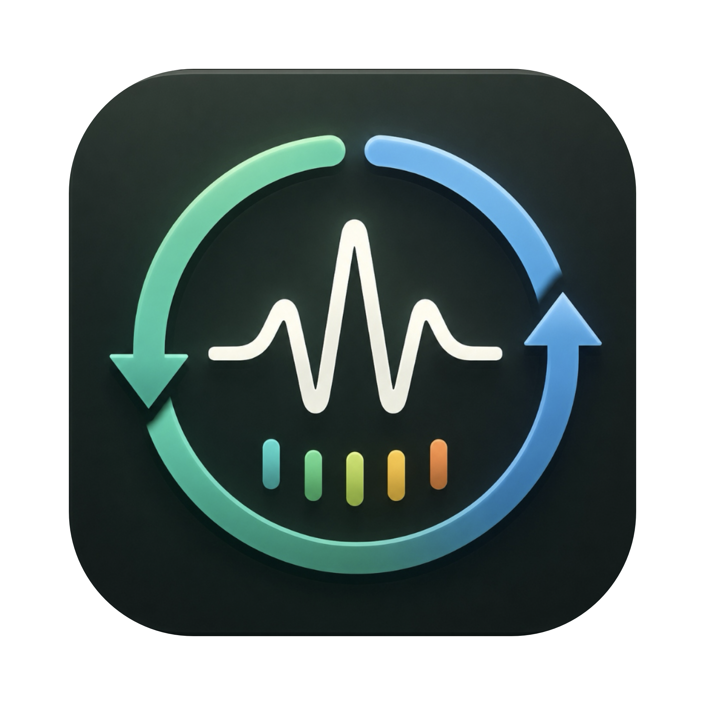

# macOS Menu Bar Network Monitor

A lightweight, native macOS menu bar utility built with **SwiftUI** and Swift Package Manager. It displays real-time upload and download speeds directly in the system status bar, refreshing every second. Clicking the menu bar item expands a premium glassmorphic dashboard showcasing detailed transfer metrics, session uptime, and active network interfaces.



## Key Features

- ⚡️ **Real-Time Speeds**: Shows upload and download rates in the menu bar, updated every second.
- 📊 **Premium Dashboard Popover**: A clean SwiftUI dashboard featuring:
  - Download and Upload speeds with color-coded high-contrast cards.
  - Active Session Statistics (bytes downloaded/uploaded since launching).
  - Lifetime System Statistics (cumulative byte counts since boot).
  - List of Active Interfaces (e.g., `en0`, `utun` VPNs) with individual bandwidth usage.
- 🚀 **Auto-Start at Login**: Configurable option inside the dashboard using macOS 13's modern `SMAppService` API.
- 📈 **High Performance & Low CPU**: Avoids expensive shell command executions. Instead, it queries Darwin's 64-bit kernel statistics via `sysctl` directly, resulting in near-zero CPU overhead.
- 🌓 **Aesthetic Light & Dark Modes**: Seamless integration with macOS accent colors, dark mode, and glassmorphic styling.
- 📦 **Swift Package Manager**: Structured entirely as an SPM project for clean dependency management and open-source contributions.

---

## Requirements

- **macOS 13.0 (Ventura)** or later.
- **Xcode 14.0** or later (for compilation).
- Swift 5.7+.

---

## Project Structure

```text
mac-network-monitor/
├── Package.swift               # Swift Package Manager configuration
├── app_icon.png                # High-res App icon source image
├── build.sh                    # Build and packaging script (.app bundle generator)
├── Sources/
│   └── NetworkMonitor/
│       ├── NetworkMonitorApp.swift   # Main SwiftUI App and MenuBarExtra setup
│       ├── NetworkStatsManager.swift # Background sysctl network polling engine
│       ├── LaunchAtLoginManager.swift# Login item registration using SMAppService
│       ├── Views/
│       │   ├── MenuBarLabelView.swift# Compact menu bar label UI
│       │   └── DashboardView.swift    # Premium dropdown/popover dashboard UI
│       └── Utils/
│           └── SpeedFormatter.swift  # Decimal formatting utility (B, KB, MB, GB, TB)
├── README.md                   # Project documentation
└── LICENSE                     # MIT License
```

---

## Design Choices & Architecture

### 64-bit Network Statistics via `sysctl`
Unlike standard implementations which use `getifaddrs` (which relies on 32-bit integer counters that wrap around at 4.29 GB of data, causing errors on fast connections), this project utilizes Darwin's low-level `sysctl` API with the `NET_RT_IFLIST2` Management Information Base (MIB). This exposes `if_data64` structures containing **64-bit counters**, providing overflow-proof data tracking.

### Interface Filtering Heuristics
To avoid inflating rates, the overall speeds and session statistics are calculated exclusively from **physical interfaces** (typically starting with `en`). Loopback (`lo0`) traffic is excluded, and virtual private network tunnels (`utun*` etc.) are displayed separately in the interface breakdown but excluded from overall sums to prevent double-counting.

### Background Polling Thread Safety
Stats polling occurs on a dedicated background dispatch queue (`com.abuzar.mac-network-monitor.stats`) using a low-power `DispatchSourceTimer`. State tracking is kept strictly local to this queue. UI updates are published back to the main thread via SwiftUI `@Published` properties, avoiding race conditions and main-thread lag.

---

## Build & Installation

You can compile the project and build a standalone `.app` bundle using the included build script:

```bash
# 1. Clone this repository (or navigate to directory)
cd mac-network-monitor

# 2. Make the build script executable (if needed)
chmod +x build.sh

# 3. Compile and bundle
./build.sh
```

The script will:
1. Compile the Swift executable in `release` mode.
2. Build the `NetworkMonitor.app` bundle directory.
3. Automatically generate the multi-resolution `.icns` file from `app_icon.png` using Apple's `sips` and `iconutil` utilities.
4. Insert the appropriate `Info.plist` keys (e.g., `LSUIElement = true` so the application runs as a background accessory with no Dock icon).
5. Apply an ad-hoc code signature.

### Launching the Application
You can launch the built application directly from Finder or using:
```bash
open build/NetworkMonitor.app
```

#### Note on First-Time Launch (Gatekeeper Warning)
Because this is an open-source project and not signed with a paid Apple Developer Account, macOS will block it on the first launch with a security warning stating that *"Apple could not verify the developer"*.

To open the app safely:
1. Double-click the app. When the warning appears, click **Done**.
2. Open **System Settings** on your Mac.
3. Go to **Privacy & Security** in the sidebar.
4. Scroll down to the **Security** section and look for the message: *"NetworkMonitor was blocked..."*
5. Click **Open Anyway**, enter your Touch ID or Mac password, and click **Open**.
6. This only needs to be done once! Subsequent launches will open instantly without warnings.

---

## License

This project is licensed under the MIT License - see the [LICENSE](LICENSE) file for details.
